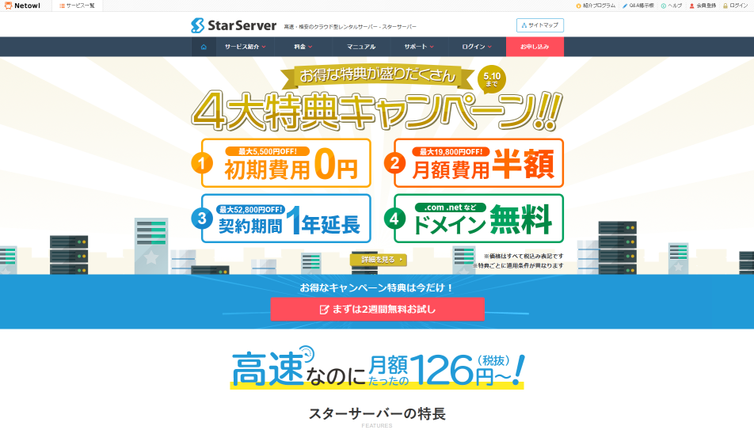

## 紹介

*水辺の白鳥*と申します。芸歴2年目のお笑い芸人です。  
**なぜこんなヘンチクな芸名なのか**とかお笑い目指した理由とか生い立ちとかは後日記事にします。

大阪の吉本興業で木っ端芸人をやりつつWEB制作会社でアルバイトに励んでおります。  
芸人になる前は2年ほどWEB制作会社でコーダーとして働きました。

お笑いに関する記事やWEBフロントエンドの技術的な記事等書いてみたくなったので、静的サイトジェネレーターで新しくサイトを作ってみました

**ここより↓はWEBに興味のない人にはつまらないと思います**(すまねえ)

## GatsbyとNetlifyでサイトを作るまで

そもそもはレンタルサーバーを借りてWordPressを設置する予定でした。

エックスドメインで独自ドメインを取り、昔使ったサーバーの中で一番コスパが良かった[スターサーバー](https://www.star.ne.jp?ref=NAhuzahv)を借りる予定でしたが、  
1/11にまずbosatsupeople.comドメインを300円ぐらいで取得した後にスターサーバーのサイトを見たら…

**5/10まで ドメイン 無料！**

ええーん😭😭  
えーんえーん😭😭😭

完全に見落としておりました  
私は少しでも「損した」と感じると全てがイヤになる身勝手な吝嗇なのでいったんスターサーバーの登録をやめました
(EC-CUBEとか使ってみたいのでたぶん後日登録します)

サーバーの契約を断念した私はかねてより興味のあった静的サイトジェネレーターでサイトを作る事にし、 
悩んだ末[Gatsby](https://www.gatsbyjs.com/) + [Netlify](https://www.netlify.com)でサイトを構築することにしました  
流行りのJAMstackってやつですわ *これで俺もモダンフロントエンドの世界へ…(?)*

### Gatsbyにした理由

静的サイトジェネレーターなら色々ありましたが

* Go(Hugo)よりはJavaScript(Nextjs, Nuxt.js, Gatsby.js)の方がまだ馴染みがある
* Reactをやってみたかった
* 一番簡単そうだった

以上の理由でGatsbyにしました。

スターターは[gatsby-starter-blog](https://www.gatsbyjs.com/starters/gatsbyjs/gatsby-starter-blog)を利用

CMSは導入しませんでした  
[Contentful](https://www.contentful.com/)等の導入も検討しましたが、どうせ個人ブログなのでマークダウンでええか…と思いマークダウンにしました

### Netlifyにした理由

ホスティングサービスについてはそれぞれの特色を比較できるほど詳しくないのですが、
一番手軽で簡単そうだったのでNetlifyにしました  
容量もでっかいです 無料版で転送量100GB/月、ストレージ100GBまで使えます

Netlify無料版ではCDNのサーバーの中に日本リージョンがなく、
その上で日本に一番近いリージョンがシンガポールなので[遅いらしい](https://blog.anatoo.jp/2020-08-03)のですが
まだ細かい事を気にするような技術もないのでまあいいんでないかと

[これ](https://dev.classmethod.jp/articles/vercel/)を見て[Vercel](https://vercel.com/)も使ってみたかったのですが営利目的の場合有料でした。  
このブログにはいつか広告を追加したいため営利利用目的にひっかかりそうなのは…と断念しました  
ひとまずNetlifyでやっております

### 導入やりかた

Git入れる  
↓  
node.js入れる  
↓  
Gatsbyとスターター入れる  
↓  
マークダウンで記事書きつつスターターをちょこちょこカスタマイズ  
↓  
Githubのアカウント作ってGatsbyのプロジェクトをリモートにプッシュ  
↓  
GithubとNetlifyを連携させてデプロイ  
↓  
Netlifyで独自ドメインの設定をする

以上です

簡単すぎて涙が出るぜ…(車線変更25時)

<iframe width="560" height="315" src="https://www.youtube.com/embed/BVP4SMHTxtU" frameborder="0" allow="accelerometer; autoplay; clipboard-write; encrypted-media; gyroscope; picture-in-picture" allowfullscreen></iframe>

とまではいきませんがそこまで難しくない作業でした

GitへのプッシュとNetlifyへのデプロイで少々つまずきましたが調べればなんとかなる範囲ではありました  
Gitの操作に慣れてる方ならもっとスムーズにビルドできると思います

HTMLとCSSと辛うじてSass、むちゃくちゃ低レベルなJSぐらいのスキルで、  
Reactはさらにさっぱりの状態でしたが、スターターを使えばサッと作れました  
HTMLとCSSが書けてWordPressの設置とちょっとしたカスタマイズができる方ならササっと使えそうな手軽さです

導入にあたっては[こちらの記事](https://takumon.com/2018/09/10/)とか「Gatsby Netlify」とか検索して出た記事等を参考にしました  

Netlifyでサブドメインが付いてないドメイン(Apexドメイン)はどうやら推奨されないようなので、独自ドメインはwww付けてサイトにアクセスする設定にしました  
wwwなしでアクセスした時のリダイレクト設定もNetlifyがよしなにやってくれるようなので最高最高です

しばらくは大きくカスタマイズする予定もないのでこれで行こうと思います

## 今後やりたい事

[Chakra UI](https://chakra-ui.com/)を使ってみたいです

**次の記事こそはお笑いに関連する記事を書きたい**